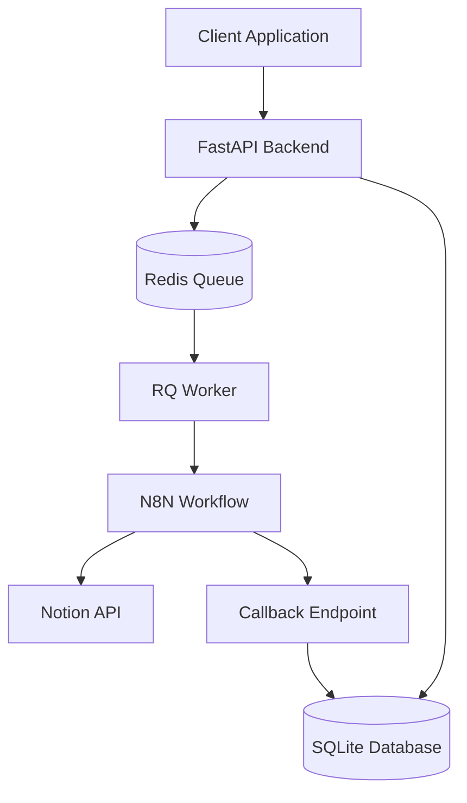

# Design Document

## Overview

The Protocol-Driven Accounting Automation System backend is a FastAPI-based microservice that serves as the synchronous entry point and asynchronous task orchestrator for receipt processing. The system follows a decoupled, event-driven architecture where the API immediately acknowledges requests and delegates heavy processing to background workers that trigger external N8N workflows.

The design emphasizes strong typing, protocol-driven interfaces, and clear separation of concerns to ensure maintainability and scalability. The system uses Redis Queue (RQ) for durable task management and SQLModel for audit logging.

## Architecture

### High-Level Architecture



### Component Interaction Flow

1. **Request Ingestion**: Client uploads receipt image via FastAPI endpoint
2. **Validation & Enqueueing**: API validates image and enqueues job in Redis
3. **Asynchronous Processing**: RQ Worker picks up job and triggers N8N workflow
4. **AI Processing**: N8N workflow processes image and creates Notion entry
5. **Status Reporting**: N8N calls back to FastAPI with completion status
6. **Audit Logging**: FastAPI updates job status in persistent database

### Architectural Principles

- **Asynchronous by Default**: Long-running operations are offloaded to background processes
- **Protocol-Driven Design**: Interfaces defined using `typing.Protocol` for loose coupling
- **Strong Typing**: All functions and classes use explicit type hints
- **Separation of Concerns**: Clear boundaries between API, business logic, and infrastructure
- **Fail-Safe Operations**: Jobs persist in Redis even if workers crash

## Components and Interfaces

### 1. API Layer (`app/api/v1/`)

**Purpose**: Handle HTTP requests and responses, perform input validation

**Key Components**:
- `receipts.py`: Handles receipt upload endpoint
- `jobs.py`: Handles callback endpoint from N8N workflow

**Interfaces**:
```python
# Receipt upload endpoint
POST /api/v1/receipts/upload
Content-Type: multipart/form-data
- file: UploadFile (image)
- notion_database_id: str

Response: JobCreationResponse
{
  "job_id": "uuid",
  "status": "queued"
}

# Callback endpoint
POST /api/v1/jobs/{job_id}/callback
Headers: X-Callback-Token: secret
Body: JobCallbackPayload
{
  "status": "success|failure",
  "message": "optional message",
  "notion_page_url": "optional URL"
}
```

### 2. Service Layer (`app/services/`)

**Purpose**: Implement business logic and orchestrate between API and infrastructure

**Key Components**:
- `TaskService`: Handles job creation and enqueueing logic
- `LoggingService`: Manages job status persistence

**Protocols**:
```python
class QueueServiceProtocol(Protocol):
    def enqueue_job(self, function_name: str, job_id: UUID, **kwargs: Any) -> None: ...
```

### 3. Infrastructure Layer (`app/infrastructure/`)

**Purpose**: Handle external system interactions (Redis, Database)

**Key Components**:
- `queue.py`: Redis Queue implementation
- `logging_db.py`: SQLModel database setup and models

### 4. Domain Layer (`app/domain/`)

**Purpose**: Define data structures and behavioral contracts

**Key Components**:
- `schemas.py`: Pydantic models for API data validation
- `protocols.py`: Protocol definitions for service interfaces

### 5. RQ Worker (`rq_worker.py`)

**Purpose**: Background process that triggers N8N workflows

**Functionality**:
- Polls Redis queue for new jobs
- Makes HTTP requests to N8N webhook endpoints
- Handles job failures and retries

## Data Models

### JobLog Database Model

```python
class JobLog(SQLModel, table=True):
    job_id: UUID = Field(primary_key=True)
    status: str = Field(index=True, default="queued")
    filename: Optional[str] = None
    created_at: datetime = Field(default_factory=datetime.utcnow)
    completed_at: Optional[datetime] = None
    result_message: Optional[str] = None
    notion_page_url: Optional[str] = None
```

### API Data Models

```python
class JobCreationResponse(BaseModel):
    job_id: UUID
    status: str = "queued"

class JobCallbackPayload(BaseModel):
    status: str
    message: Optional[str] = None
    notion_page_url: Optional[str] = None
```

### Configuration Model

```python
class Settings(BaseSettings):
    API_V1_STR: str = "/api/v1"
    REDIS_URL: str = "redis://localhost:6379"
    N8N_WEBHOOK_URL: str
    N8N_API_KEY: str
    CALLBACK_SECRET_TOKEN: str
    DATABASE_URL: str = "sqlite:///./job_logs.db"
```

## Error Handling

### API Error Responses

- **400 Bad Request**: Invalid image format, missing required fields
- **401 Unauthorized**: Invalid callback token
- **413 Payload Too Large**: Image file exceeds size limit
- **422 Unprocessable Entity**: Validation errors in request data
- **500 Internal Server Error**: Unexpected system errors

### Background Job Error Handling

- **Redis Connection Failures**: Jobs are retried with exponential backoff
- **N8N Webhook Failures**: Jobs moved to failed queue for manual inspection
- **Callback Failures**: Logged but don't affect job processing

### Error Logging Strategy

- Structured JSON logging for all components
- Error context includes job_id, timestamps, and stack traces
- Failed jobs preserved in Redis failed queue
- Database constraints prevent duplicate job entries

## Testing Strategy

### Unit Testing

- **Service Layer**: Mock external dependencies using protocols
- **API Layer**: Use FastAPI TestClient for endpoint testing
- **Infrastructure Layer**: Use in-memory Redis and SQLite for testing
- **Domain Layer**: Test Pydantic model validation and serialization

### Integration Testing

- **End-to-End Flow**: Test complete workflow from upload to callback
- **Redis Integration**: Verify job enqueueing and worker processing
- **Database Integration**: Test job logging and status updates
- **External API Mocking**: Mock N8N webhook responses

### Test Structure

```
tests/
├── unit/
│   ├── test_services/
│   ├── test_api/
│   └── test_domain/
├── integration/
│   ├── test_workflows/
│   └── test_database/
└── fixtures/
    ├── sample_images/
    └── mock_responses/
```

### Testing Tools

- **pytest**: Primary testing framework
- **pytest-asyncio**: For testing async functions
- **httpx**: For testing HTTP clients
- **fakeredis**: In-memory Redis for testing
- **pytest-mock**: For mocking external dependencies

## Security Considerations

### Authentication & Authorization

- Callback endpoints protected by shared secret tokens
- N8N webhook calls authenticated with API keys
- No user authentication required for upload endpoint (assumed to be behind auth gateway)

### Data Protection

- Image data not persisted in backend database
- Sensitive configuration loaded from environment variables
- API keys and tokens never logged or exposed in responses

### Input Validation

- File type validation using both content-type headers and magic bytes
- File size limits enforced to prevent DoS attacks
- Notion database ID format validation
- Request payload size limits

## Performance Considerations

### Scalability Design

- **Horizontal Scaling**: Multiple API instances can share Redis queue
- **Worker Scaling**: RQ workers can be scaled independently
- **Database Optimization**: Indexed queries on job_id and status fields
- **Memory Management**: Image data streamed and not cached

### Performance Optimizations

- **Async File Handling**: Non-blocking file operations in FastAPI
- **Connection Pooling**: Redis connection reuse across requests
- **Background Processing**: Heavy operations offloaded from API thread
- **Efficient Serialization**: Minimal data passed between components

### Monitoring Metrics

- Queue depth and processing rates
- Job success/failure ratios
- API response times
- Worker processing times
- Database query performance